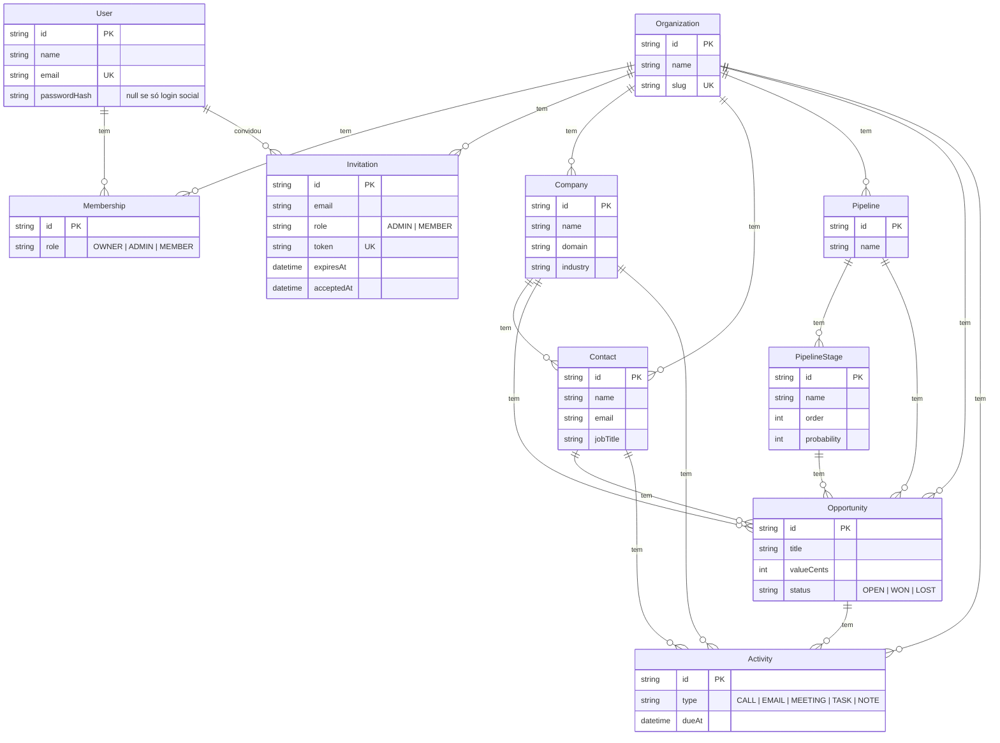

# CRM Platform

CRM multi-tenant (SaaS): conecta empresas, contatos e oportunidades de vendas num só lugar, com cada organização que assina o produto isolada das demais.

## A proposta

A ideia é um CRM que qualquer empresa pode assinar — não uma ferramenta interna de uma equipe só. Isso muda a arquitetura desde a base: todo dado de negócio (empresa, contato, oportunidade, atividade) pertence a uma **organização** (o tenant), e nenhuma query pode vazar dado de uma organização pra outra. Esse isolamento é a decisão arquitetural mais importante do projeto e está descrito em detalhe abaixo.

## Stack e por quê

- **Next.js (App Router) + TypeScript** — front-end e back-end no mesmo projeto: Server Components pra leitura, Server Actions pra mutação, sem precisar manter uma API REST separada.
- **PostgreSQL + Prisma** — dado de CRM é fundamentalmente relacional (empresa → contatos → oportunidades → atividades); um banco relacional modela isso melhor que um documento solto.
- **Auth.js v5 (Credentials + JWT)** — login com e-mail/senha como caminho principal. Login social (Google/Microsoft) é opcional e resolvido sem Prisma Adapter — ver [Login social](#login-social) abaixo.
- **Zod** — validação de input nas Server Actions.
- **Tailwind CSS** — estilização, sem depender de uma lib de componentes ainda.
- **Vitest** — testes de integração dos repositórios contra Postgres real (não mock) — ver [Testes](#testes).

## Isolamento multi-tenant (regra dura)

Toda tabela de dado de negócio (`Company`, `Contact`, `Opportunity`, `Pipeline`, `PipelineStage`, `Activity`, `Invitation`) tem uma coluna `organizationId` obrigatória. A estratégia é **banco compartilhado com discriminador de tenant** (não schema-per-tenant nem database-per-tenant) — mais simples de operar em escala pequena/média, e é o padrão que a maioria dos CRMs SaaS usa pra começar.

Isso só é seguro se for **impossível esquecer o filtro**. Por isso:

1. `src/server/repositories/*.ts` é a única camada que fala com o Prisma pra dado de negócio. Toda função de repositório recebe `organizationId` como **primeiro argumento obrigatório** — não opcional, não com default. Não tem como chamar `listCompanies()` sem passar um tenant.
2. `organizationId` nunca vem do cliente (nunca de um input de formulário ou query param). Ele vem *só* da sessão autenticada (`auth()`), que por sua vez só é populada a partir da `Membership` do usuário no banco (ver `src/auth.ts`).
3. Quando uma entidade referencia outra por id vindo de um `<select>` do formulário (ex: vincular um Contato a uma Empresa, ou uma Oportunidade a uma Etapa de pipeline), o repositório **revalida** que o id pertence à mesma organização antes de gravar — nunca confia que o id do form já veio filtrado (ver `createContact`, `createOpportunity`, `createStage`, `createInvitation`).
4. Consequência: pra vazar dado entre tenants, alguém precisaria literalmente inventar um `organizationId` (ou um id de outra entidade de outra organização) que não é o da própria sessão — não existe input de usuário que alcança essa variável sem passar pela revalidação do passo 3.

Isso foi testado manualmente durante boa parte do desenvolvimento e agora tem cobertura automatizada — ver [Testes](#testes).

## Modelo de dados



Schema completo (com comentários explicando cada decisão) em [prisma/schema.prisma](prisma/schema.prisma).

Detalhes que valem nota:

- `Opportunity.valueCents` guarda valor em centavos (inteiro), não float — evita erro de arredondamento com dinheiro.
- Um `User` não pertence a uma `Organization` diretamente — a relação passa por `Membership`, o que permite um usuário pertencer a mais de uma organização (dá pra trocar de organização ativa em `/settings`).
- `User.passwordHash` é opcional: fica `null` pra conta criada só via login social (ver [Login social](#login-social)).
- `Activity` existe no schema e no diagrama, mas **ainda não tem UI/módulo próprio** — é o item mais visível que falta (ver Roadmap).

## O que está implementado

- [x] Schema completo do banco (todas as entidades do diagrama acima)
- [x] Signup: cria organização + usuário + membership (OWNER) numa transação, já autentica
- [x] Login/logout (Auth.js, Credentials + JWT, senha com bcrypt)
- [x] Login social (Google, Microsoft) — opcional, por variável de ambiente (ver [Login social](#login-social))
- [x] Proteção de rotas: middleware/proxy pra navegação (`src/proxy.ts`) **e** verificação independente em cada Server Action — nenhuma mutação confia só no proxy
- [x] Dashboard com contagem de empresas/contatos/oportunidades da organização
- [x] Módulos de **Empresas**, **Contatos**, **Pipeline** (com etapas) e **Oportunidades** — CRUD (listar + criar) com tenant scoping de ponta a ponta
- [x] Convite de membros pra uma organização existente, com link de convite, aceite por quem já tem conta e aceite criando conta nova (`/invite/[token]`)
- [x] Suporte a usuário em múltiplas organizações, com troca de organização ativa em `/settings`
- [x] Testes automatizados (Vitest) cobrindo os repositórios e o isolamento multi-tenant
- [ ] Módulo de **Atividades** (ligação/e-mail/reunião/tarefa/nota) — modelo existe no schema, sem UI ainda
- [ ] Kanban de verdade pro Pipeline (hoje é lista de etapas, não board com drag-and-drop)
- [ ] Envio de e-mail de convite (hoje o link é gerado e mostrado em `/settings` pra copiar e mandar manualmente — não há provedor de e-mail integrado)
- [ ] Deploy (ver Roadmap)

## Login social

Google e Microsoft são opcionais e resolvidos **sem Prisma Adapter** — não existem tabelas `Account`/`Session`/`VerificationToken`. Em vez disso, `src/auth.ts` tem um callback `signIn` que:

1. Se já existe um `User` com aquele e-mail, associa o login à conta e à primeira organização dele.
2. Se não existe, cria organização + usuário + membership `OWNER` na hora (mesmo padrão do `/signup` por e-mail/senha), sem pedir nome de organização.

Essa escolha evita o atrito de tipos entre o client-output customizado do Prisma 7 e o `@auth/prisma-adapter` (que espera `@prisma/client` no caminho padrão), e mantém uma única fonte de verdade pra "como um usuário ganha uma organização" (comparar com `signUpAction`).

Cada provider só aparece como botão em `/login` e `/signup` se as variáveis de ambiente dele estiverem preenchidas (ver [Variáveis de ambiente](#variáveis-de-ambiente)) — sem credenciais, o app funciona normal só com e-mail/senha.

## Estrutura

```
src/
  app/
    page.tsx              # landing pública
    login/, signup/        # auth, público (com botões de login social opcionais)
    invite/[token]/        # aceite de convite, público
    (app)/                 # grupo de rotas autenticadas (sidebar comum)
      layout.tsx            # checa sessão, redireciona se não logado
      dashboard/
      companies/, contacts/, opportunities/, pipelines/  # CRUD completo
      settings/             # membros, convites, troca de organização
    api/auth/[...nextauth]/  # route handler do Auth.js
  server/
    db.ts                  # Prisma Client (com driver adapter, ver nota Prisma 7)
    repositories/           # única camada que fala com o Prisma — sempre recebe organizationId
    actions/                # Server Actions ("use server") — validam sessão + input, chamam repositories
  lib/
    validation/             # schemas Zod
    slugify.ts              # usado no /signup e no primeiro login social
  components/
    social-login-buttons.tsx  # botões condicionais de Google/Microsoft
  test/helpers.ts           # utilitários compartilhados pelos testes de repositório
  auth.ts                  # config completa do Auth.js (Credentials + OAuth, Node runtime)
  auth.config.ts            # config "leve" sem provider Node — usada pelo proxy (Edge)
  proxy.ts                  # middleware/proxy: redireciona não-autenticado antes de renderizar
  types/next-auth.d.ts      # extende o tipo de Session/JWT com organizationId/role
prisma/
  schema.prisma
  migrations/
vitest.config.ts
```

## Rodando localmente

```bash
npm install
cp .env.example .env

# Banco local sem precisar instalar Postgres: roda um Postgres real na sua
# máquina, gerenciado pelo Prisma. Deixa esse comando rodando num terminal:
npx prisma dev

# Copie as DUAS URLs que o comando acima imprimiu (DATABASE_URL e
# SHADOW_DATABASE_URL) pro seu .env, depois, noutro terminal:
npx prisma migrate dev
npm run dev
```

Abra http://localhost:3000, crie uma organização em `/signup`, e pronto — todos os módulos (Empresas, Contatos, Pipeline, Oportunidades, Configurações) já funcionam de ponta a ponta.

Alternativas ao `npx prisma dev` pra banco local: Docker (`postgres:16` na porta 5432) ou um Postgres gerenciado na nuvem (Neon, Supabase, Railway — todos têm free tier e funcionam direto com a `DATABASE_URL` do `.env.example`). Com essas alternativas, `SHADOW_DATABASE_URL` não é necessária.

### Nota sobre `npx prisma dev`

O `npx prisma dev` não roda Postgres de verdade — é [PGlite](https://pglite.dev/) (Postgres embarcado em WASM, processo único). Isso é ótimo pra zero-config, mas tem duas pegadinhas:

- **O shadow database é a mesma URL numa porta diferente** (a porta base +1), não um nome de banco diferente na mesma porta — o próprio `npx prisma dev` imprime as duas URLs quando sobe; copie exatamente o que ele mostrar.
- **Não segura bem queries concorrentes.** Por isso todo Server Component desse projeto faz suas leituras em sequência (`await` uma de cada vez), não em `Promise.all` — é proposital, não descuido (ver comentários em `src/server/repositories/organizations.ts` e nas páginas). Se você trocar pra um Postgres de verdade (Docker ou gerenciado), pode paralelizar essas leituras sem problema.
- Se o processo for encerrado à força (ex: matar o processo em vez de `Ctrl+C`) e o próximo `npx prisma dev` disser "já está rodando" mesmo sem nada nas portas, apague `%LOCALAPPDATA%\prisma-dev-nodejs\Data\default\.pglite\postmaster.pid` (Windows) e suba de novo — é um lockfile órfão.

### Nota sobre Prisma 7

Esse projeto usa o novo client generator do Prisma 7 (`provider = "prisma-client"`), que **não lê mais `DATABASE_URL` sozinho a partir do schema** — o client exige um [driver adapter](https://pris.ly/d/prisma7-client-config) explícito. Por isso `src/server/db.ts` usa `@prisma/adapter-pg`, configurado com um `pg.PoolConfig` explícito (não a connection string crua) — os parâmetros de query string do estilo antigo do Prisma (`connection_limit=`, `pool_timeout=` etc.) são do engine Rust antigo e o driver `pg` os ignora silenciosamente.

## Testes

```bash
npm test
```

Os testes (`src/server/repositories/*.test.ts`) rodam **contra o Postgres real** de `DATABASE_URL`, não contra um mock — mesma filosofia do resto do projeto: o isolamento multi-tenant só é confiável se for verificado contra o comportamento de verdade do Prisma/Postgres. Cada arquivo cria e limpa suas próprias organizações de teste.

Cobrem: CRUD básico de cada módulo, rejeição de ids de outra organização (a revalidação descrita em [Isolamento multi-tenant](#isolamento-multi-tenant-regra-dura)), convite → aceite (conta nova e usuário existente), convite expirado/reutilizado, e membership em múltiplas organizações.

**Não cobrem** (fica pro roadmap): as Server Actions em si (a fina camada de `auth()` + parse do Zod + chamada ao repositório) e testes de UI/browser — essas partes foram validadas manualmente via HTTP real durante o desenvolvimento, mas não têm suíte automatizada ainda.

## Variáveis de ambiente

Ver [.env.example](.env.example). Resumo:

- `DATABASE_URL` — string de conexão do Postgres
- `SHADOW_DATABASE_URL` — só necessária com `npx prisma dev` local (ver nota acima)
- `AUTH_SECRET` — segredo do Auth.js pra assinar o cookie de sessão (gere com `npx auth secret`)
- `AUTH_GOOGLE_ID` / `AUTH_GOOGLE_SECRET` — opcional, login social Google
- `AUTH_MICROSOFT_ENTRA_ID_ID` / `AUTH_MICROSOFT_ENTRA_ID_SECRET` / `AUTH_MICROSOFT_ENTRA_ID_ISSUER` — opcional, login social Microsoft
- `RESEND_API_KEY` / `RESEND_FROM_EMAIL` — opcional, envio automático do e-mail de convite (ver [.env.example](.env.example))

## Deploy (Vercel + Neon)

Stack escolhida: **Vercel** pra hospedar o app, **Neon** como Postgres gerenciado, **Resend** pro e-mail de convite. O código já está pronto pra isso — falta só criar as contas e configurar as variáveis de ambiente (isso aqui é o único pedaço que exige ação sua fora do editor, porque envolve contas de terceiros).

1. **Neon**: crie um projeto em [neon.tech](https://neon.tech), copie a connection string (já vem com `sslmode=require`, funciona direto como `DATABASE_URL`).
2. **Aplique o schema no banco do Neon** (uma vez, local, antes do primeiro deploy):
   ```bash
   DATABASE_URL="<connection string do Neon>" npx prisma migrate deploy
   ```
   Isso roda as migrations em `prisma/migrations/` direto no banco de produção — não precisa de `SHADOW_DATABASE_URL` (`migrate deploy` não usa shadow database, só `migrate dev` usa).
3. **Resend**: crie uma conta em [resend.com](https://resend.com), pegue a API key em [resend.com/api-keys](https://resend.com/api-keys). Pra remetente de verdade (não o sandbox `onboarding@resend.dev`), verifique um domínio em [resend.com/domains](https://resend.com/domains).
4. **Vercel**: importe o repositório em [vercel.com/new](https://vercel.com/new) — ele detecta Next.js automaticamente, não precisa mexer em build settings. Antes do primeiro deploy, configure as variáveis de ambiente do projeto na Vercel (Settings → Environment Variables):
   - `DATABASE_URL` — a connection string do Neon (passo 1)
   - `AUTH_SECRET` — gere um novo com `npx auth secret`, **diferente** do valor de dev no seu `.env` local
   - `RESEND_API_KEY` / `RESEND_FROM_EMAIL` — do passo 3
   - `AUTH_GOOGLE_ID`/`AUTH_GOOGLE_SECRET` e/ou `AUTH_MICROSOFT_ENTRA_ID_*` — só se for usar login social em produção (troque o redirect URI cadastrado no Google/Azure pro seu domínio final, ver `.env.example`)
   - **Não** defina `SHADOW_DATABASE_URL` na Vercel — só é usada localmente com `prisma migrate dev`.
5. Deploy. `npm run postinstall` (`prisma generate`) roda automaticamente depois do `npm install` da Vercel — é por isso que existe esse script no `package.json`, sem ele o build falha porque o Prisma Client não existe ainda no momento do `next build`.

Depois do primeiro deploy: toda vez que você mudar `prisma/schema.prisma`, gere a migration localmente (`npx prisma migrate dev --name algo`) e rode o passo 2 de novo contra o Neon antes (ou depois) de fazer o deploy da mudança de código correspondente.

## Roadmap

- [ ] Módulo de **Atividades** — repetir o padrão de `src/app/(app)/companies` + `src/server/{repositories,actions}/companies.ts`
- [ ] Kanban de verdade pro Pipeline (drag-and-drop entre etapas) — hoje é lista; precisa de um Client Component
- [ ] Edição e exclusão de registros (hoje só criar + listar em todo módulo)
- [ ] Login social em produção — código já pronto (ver [Login social](#login-social)), só falta gerar as credenciais reais e configurar na Vercel quando/se for usar
