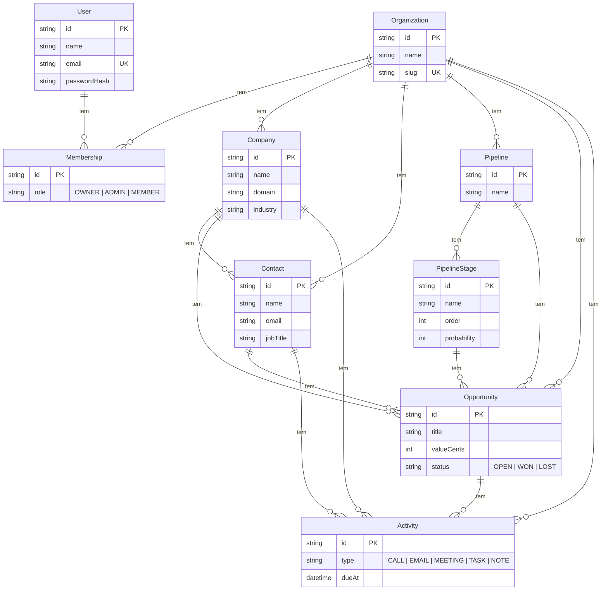

# CRM Platform

CRM multi-tenant (SaaS): conecta empresas, contatos e oportunidades de vendas num só lugar, com cada organização que assina o produto isolada das demais.

## A proposta

A ideia é um CRM que qualquer empresa pode assinar — não uma ferramenta interna de uma equipe só. Isso muda a arquitetura desde a base: todo dado de negócio (empresa, contato, oportunidade, atividade) pertence a uma **organização** (o tenant), e nenhuma query pode vazar dado de uma organização pra outra. Esse isolamento é a decisão arquitetural mais importante do projeto e está descrito em detalhe abaixo.

## Stack e por quê

- **Next.js (App Router) + TypeScript** — front-end e back-end no mesmo projeto: Server Components pra leitura, Server Actions pra mutação, sem precisar manter uma API REST separada.
- **PostgreSQL + Prisma** — dado de CRM é fundamentalmente relacional (empresa → contatos → oportunidades → atividades); um banco relacional modela isso melhor que um documento solto.
- **Auth.js v5 (Credentials + JWT)** — login com e-mail/senha pra começar rápido sem depender de credenciais de OAuth de terceiros. Trocar/adicionar provedores OAuth depois é só configuração (ver Roadmap).
- **Zod** — validação de input nas Server Actions.
- **Tailwind CSS** — estilização, sem depender de uma lib de componentes ainda.

## Isolamento multi-tenant (regra dura)

Toda tabela de dado de negócio (`Company`, `Contact`, `Opportunity`, `Pipeline`, `Activity`) tem uma coluna `organizationId` obrigatória. A estratégia é **banco compartilhado com discriminador de tenant** (não schema-per-tenant nem database-per-tenant) — mais simples de operar em escala pequena/média, e é o padrão que a maioria dos CRMs SaaS usa pra começar.

Isso só é seguro se for **impossível esquecer o filtro**. Por isso:

1. `src/server/repositories/*.ts` é a única camada que fala com o Prisma pra dado de negócio. Toda função de repositório recebe `organizationId` como **primeiro argumento obrigatório** — não opcional, não com default. Não tem como chamar `listCompanies()` sem passar um tenant.
2. `organizationId` nunca vem do cliente (nunca de um input de formulário ou query param). Ele vem *só* da sessão autenticada (`auth()`), que por sua vez só é populada a partir da `Membership` do usuário no banco (ver `src/auth.ts`).
3. Consequência: pra vazar dado entre tenants, alguém precisaria literalmente inventar um `organizationId` que não é o da própria sessão — não existe input de usuário que alcança essa variável.

Isso foi testado manualmente durante o desenvolvimento: várias organizações foram criadas e cada uma só enxerga as próprias empresas.

## Modelo de dados



Schema completo (com comentários explicando cada decisão) em [prisma/schema.prisma](prisma/schema.prisma).

Detalhes que valem nota:

- `Opportunity.valueCents` guarda valor em centavos (inteiro), não float — evita erro de arredondamento com dinheiro.
- Um `User` não pertence a uma `Organization` diretamente — a relação passa por `Membership`, já preparando terreno pra um usuário poder pertencer a mais de uma organização no futuro (hoje o app assume a primeira membership, ver Roadmap).
- `Pipeline`/`PipelineStage` existem desde já no schema (uma organização pode ter mais de um funil de vendas), mas a Kanban/UI de pipeline ainda não foi construída — só o módulo de Empresas está implementado de ponta a ponta (ver abaixo).

## O que está implementado

- [x] Schema completo do banco (todas as entidades do diagrama acima)
- [x] Signup: cria organização + usuário + membership (OWNER) numa transação, já autentica
- [x] Login/logout (Auth.js, Credentials + JWT, senha com bcrypt)
- [x] Proteção de rotas: middleware/proxy pra navegação (`src/proxy.ts`) **e** verificação independente em cada Server Action — nenhuma mutação confia só no proxy (ver comentário em `src/auth.config.ts`)
- [x] Dashboard com contagem de empresas/contatos/oportunidades da organização
- [x] Módulo de **Empresas** completo: listar + criar, com tenant scoping — é o "slice vertical de referência" pros próximos módulos
- [ ] Contatos, Oportunidades, Pipeline (Kanban), Configurações — telas existem como placeholder, seguem o mesmo padrão de Empresas (ver Roadmap)

## Estrutura

```
src/
  app/
    page.tsx              # landing pública
    login/, signup/        # auth, público
    (app)/                 # grupo de rotas autenticadas (sidebar comum)
      layout.tsx            # checa sessão, redireciona se não logado
      dashboard/
      companies/            # único módulo com CRUD real por enquanto
      contacts/, opportunities/, pipelines/, settings/  # placeholders
    api/auth/[...nextauth]/  # route handler do Auth.js
  server/
    db.ts                  # Prisma Client (com driver adapter, ver nota Prisma 7)
    repositories/           # única camada que fala com o Prisma — sempre recebe organizationId
    actions/                # Server Actions ("use server") — validam sessão + input, chamam repositories
  lib/validation/           # schemas Zod
  auth.ts                  # config completa do Auth.js (Credentials, Node runtime)
  auth.config.ts            # config "leve" sem provider Node — usada pelo proxy (Edge)
  proxy.ts                  # middleware/proxy: redireciona não-autenticado antes de renderizar
  types/next-auth.d.ts      # extende o tipo de Session/JWT com organizationId/role
prisma/
  schema.prisma
  migrations/
```

## Rodando localmente

```bash
npm install
cp .env.example .env

# Banco local sem precisar instalar Postgres: roda um Postgres real na sua
# máquina, gerenciado pelo Prisma. Deixa esse comando rodando num terminal:
npx prisma dev

# noutro terminal — copie a DATABASE_URL que o comando acima imprimiu pro seu .env, depois:
npx prisma migrate dev
npm run dev
```

Abra http://localhost:3000, crie uma organização em `/signup`, e pronto — o módulo de Empresas já funciona de ponta a ponta.

Alternativas ao `npx prisma dev` pra banco local: Docker (`postgres:16` na porta 5432) ou um Postgres gerenciado na nuvem (Neon, Supabase, Railway — todos têm free tier e funcionam direto com a `DATABASE_URL` do `.env.example`).

### Nota sobre Prisma 7

Esse projeto usa o novo client generator do Prisma 7 (`provider = "prisma-client"`), que **não lê mais `DATABASE_URL` sozinho a partir do schema** — o client exige um [driver adapter](https://pris.ly/d/prisma7-client-config) explícito. Por isso `src/server/db.ts` usa `@prisma/adapter-pg` construído com `DATABASE_URL` do ambiente, em vez do padrão antigo `new PrismaClient()`.

## Variáveis de ambiente

Ver [.env.example](.env.example). Resumo:

- `DATABASE_URL` — string de conexão do Postgres
- `AUTH_SECRET` — segredo do Auth.js pra assinar o cookie de sessão (gere com `npx auth secret`)

## Roadmap

- [ ] Módulos de Contatos, Oportunidades e Pipeline (Kanban) — repetir o padrão de `src/app/(app)/companies` + `src/server/{repositories,actions}/companies.ts`
- [ ] Convite de membros pra uma organização existente (hoje só existe "criar organização nova" no signup)
- [ ] Suporte a usuário pertencer a mais de uma organização (o schema com `Membership` já permite; falta UI de troca de organização — hoje o login assume a primeira membership)
- [ ] Login social (Google/Microsoft) via Auth.js — adicionar provider em `src/auth.ts`; para providers OAuth com Prisma Adapter, o schema precisa ganhar os models `Account`/`Session`/`VerificationToken` que o Auth.js espera
- [ ] Testes automatizados (nenhum ainda — o fluxo de auth + multi-tenancy foi validado manualmente durante o desenvolvimento, mas não há suíte)
- [ ] Deploy (Vercel + Postgres gerenciado é o caminho mais direto dado a stack)
